```mermaid
gitGraph
    commit id: "☝️ added README"
    commit id: "feat - diagrams"
    branch mindmaps
    commit id: "feat - mindmaps"
    checkout main
    merge mindmaps
    branch components
    commit id: "feat - components"
    checkout main
    commit id: "📚 doc - project description"
    merge components tag: "1.0.0"
```

# compiiile-pro added features <Icon name="star" />

## Customize style by providing your own CSS file

You can customize every bit of the UI with your own style by passing a `css` param with the relative path to your css file :

```bash
compiiile-pro dev --css="./custom.css"
```

Here is an example of a CSS file content to set some colors and the default font:

```css
@import url(https://fonts.bunny.net/css?family=inter:200i,400,400i,900);

:root {
	--layout-background-color: #0000ff;
	--darker-background-color: #00ff00;
	--default-font: "Inter", sans-serif;
}
```

:nail_care: The list of global CSS variables can be found here : https://github.com/compiiile/compiiile/blob/master/.compiiile/src/style/variables.css

:rainbow: You can also just target CSS classes and tweak them the way you want.

## Admonitions

> [!NOTE]
> A note to `highlight` information for users.

> [!NOTE] Some custom title
> A note to highlight information for users.

> [!NOTE] Custom title
>
> > [!NOTE] Custom title
> > Admonition-ception, yes that's possible!

> [!TIP]
> Optional information to `help` a user be more successful.

> [!IMPORTANT]
> Crucial information `necessary` for users to succeed.

> [!WARNING]
> Critical content demanding `immediate` user attention due to potential risks.

> [!CAUTION]
> `Negative` potential consequences of an action.

<details>
    <summary>Display the source:</summary>

    ```md
    > [!NOTE]
    > A note to `highlight` information for users.

    > [!NOTE] Some custom title
    > A note to highlight information for users.

    > [!NOTE] Custom title
    >
    > > [!NOTE] Custom title
    > > Admonition-ception, yes that's possible!

    > [!TIP]
    > Optional information to `help` a user be more successful.

    > [!IMPORTANT]
    > Crucial information `necessary` for users to succeed.

    > [!WARNING]
    > Critical content demanding `immediate` user attention due to potential risks.

    > [!CAUTION]
    > `Negative` potential consequences of an action.
    ```

</details>

## Diagrams


<details>
    <summary>Source</summary>

    ````md
        ```mermaid
        graph TD
        B( compiiile-pro ) -->|Is amazing! | C{ What does it do? }
        C --> D[ Write diagrams in Markdown ]
        C --> E[ Display mindmaps ]
        C --> F[ Use a collection of components ]
        ```
    ````

</details>

```markmap
---
markmap:
    width: 100%
---

- compiiile-pro
  - diagrams
  - mindmaps
  - components
    - icons
    - layout
```

<details>
    <summary>Source</summary>

    ````md
    ```markmap
    ---
    markmap:
        width: 100%
    ---

    - compiiile-pro
        - diagrams
        - mindmaps
        - components
            - icons
            - layout
    ```
    ````

</details>

---



<details>
    <summary>Source</summary>

    ````md
    ```mermaid
    gitGraph
    commit id: "☝️ added README"
    commit id: "feat - diagrams"
    branch mindmaps
    commit id: "feat - mindmaps"
    checkout main
    merge mindmaps
    branch components
    commit id: "feat - components"
    checkout main
    commit id: "📚 doc - project description"
    merge components tag: "1.0.0"
    ```
    ````

</details>

---


<details>
    <summary>Source</summary>

    ````md
    ```mermaid
    sequenceDiagram
    Client->>Server: GET /products
    Server-->>Client: Return product list
    ```
    ````

</details>

---


<details>
    <summary>Source</summary>

    ````md
    ```mermaid
    classDiagram
    class BankAccount
    BankAccount : +String owner
    BankAccount : +Bigdecimal balance
    BankAccount : +deposit(amount)
    BankAccount : +withdrawal(amount)
    ```
    ````

</details>

---


<details>
    <summary>Source</summary>

    ````md
    ```mermaid
    stateDiagram-v2
    [*] --> Still
    Still --> [*]

    Still --> Moving
    Moving --> Still
    Moving --> Crash
    Crash --> [*]
    ```
    ````

</details>

---


<details>
    <summary>Source</summary>

    ````md
    ```mermaid
    erDiagram
    CUSTOMER ||--o{ ORDER : places
    ORDER ||--|{ LINE-ITEM : contains
    CUSTOMER }|..|{ DELIVERY-ADDRESS : uses
    ```
    ````

</details>

---


<details>
    <summary>Source</summary>

    ````md

`````mermaid
 gantt
     title A Gantt Diagram
     dateFormat YYYY-MM-DD
     section Section
         A task          :a1, 2014-01-01, 30d
         Another task    :after a1, 20d
     section Another
         Task in Another :2014-01-12, 12d
         another task    :24d
 ```
 ````
</details>

---


<details>
    <summary>Source</summary>

    ````md
    ```mermaid
    xychart-beta
        title "Sales Revenue"
        x-axis [jan, feb, mar, apr, may, jun, jul, aug, sep, oct, nov, dec]
        y-axis "Revenue (in $)" 4000 --> 11000
        bar [5000, 6000, 7500, 8200, 9500, 10500, 11000, 10200, 9200, 8500, 7000, 6000]
        line [5000, 6000, 7500, 8200, 9500, 10500, 11000, 10200, 9200, 8500, 7000, 6000]
    ```
    ````

</details>

---


<details>
    <summary>Source</summary>

    ````md
    ```mermaid
    timeline
        title History of Social Media Platform
        2002 : LinkedIn
        2004 : Facebook
             : Google
        2005 : Youtube
        2006 : Twitter
    ```
    ````

</details>

---

```d2
direction: right

costumes: {
  shape: sql_table
  id: int {constraint: primary_key}
  silliness: int
  monster: int
  last_updated: timestamp
}

monsters: {
  shape: sql_table
  id: int {constraint: primary_key}
  movie: string
  weight: int
  last_updated: timestamp
}

costumes.monster -> monsters.id
costumes.style.border-radius: 4
monsters.style.border-radius: 4

style: {
  fill: "#eeeeee"
}
```

<details>
    <summary>Source</summary>

    ````md
    ```d2
    direction: right

    costumes: {
        shape: sql_table
        id: int {constraint: primary_key}
        silliness: int
        monster: int
        last_updated: timestamp
    }

    monsters: {
        shape: sql_table
        id: int {constraint: primary_key}
        movie: string
        weight: int
        last_updated: timestamp
    }

    costumes.monster -> monsters.id
    costumes.style.border-radius: 4
    monsters.style.border-radius: 4

    style: {
        fill: "#eeeeee"
    }
    ```
    ````

</details>

## Code blocks

Code block all have a copy content button with the pro version. The file type will be displayed, and you can also display a custom filename:

```bash filename="script.sh"
yarn dev
```

```bash
yarn add @compiiile/compiiile-pro
```

````mdx
```bash filename="script.sh"
yarn dev
```

```bash
yarn add @compiiile/compiiile-pro
```
````

## Components

Components are usable in `mdx` files without importing them.

### Icon

The `Icon` component is used to display an icon from the PhosphorIcons library. The icon name has to be passed in the `name` prop.

> Some blockquote with an icon <Icon name="github-logo" />

```mdx
> Some blockquote with an icon <Icon name="github-logo" />
```

You can also use icons in regular Markdown files (not `mdx`) by using the `i` tag with appropriate classes: `<i class="ph ph-smiley"></i>`

In Vue components, you can use the following syntax to dynamically import the icon you want: `<i-ph-user />`

### CGrid

The `CGrid` component allows you to use a grid layout (very useful for slides):

```mdx
<CGrid template="2 1" align="center">
    <div>
        # Title

        Lorem ipsum dolor sit amet, consectetur adipiscing elit, sed do eiusmod tempor incididunt ut labore et dolore magna aliqua. Ut enim ad minim veniam, quis nostrud exercitation ullamco laboris nisi ut aliquip ex ea commodo consequat. Duis aute irure dolor in reprehenderit in voluptate velit esse cillum dolore eu fugiat nulla pariatur. From [xodnnhm](https://giphy.com/xodnnhm).
    </div>

    
</CGrid>
```

- The `template` prop works just like the `grid-template-columns` CSS property, you can omit the `fr` unit, it will be processed automatically.
    - `template="1 1"` will make 2 columns of equal width
    - `template="2 1"` will make 2 columns with the first one using 2/3 width
- You can vertically align items with the `align` prop, working like the `align-items` CSS property.
- You can specify the gap between components with the `gap` prop (defaults to `40px`)

### CCard

The `CCard` component can be used as a traditional card or a link.

- The `title` and `description` slots can be used for traditional cards
- To get it to work as a link, just provide a Markdown link as default slot, and specify a hint text if needed with the `hintText` prop

<CGrid gap="20px" template="1 1">
    <CCard hintText="Go to the specific page">
        [Some link](./3-pro-installation.md)
    </CCard>

    <CCard>
        [Link (without hint)](./3-pro-installation.md)
    </CCard>

    <CCard>
        <span slot="title">Title</span>
        <span slot="description">Some description</span>
    </CCard>

</CGrid>

&nbsp;

<details>
    <summary>Source</summary>

    ````mdx
    <CGrid gap="20px" template="1 1">
        <CCard hintText="Go to the specific page">
            [Check compiiile-pro installation](./3-pro-installation.md)
        </CCard>

        <CCard>
            [Link (with hover hint)](./3-pro-installation.md)
        </CCard>

        <CCard>
            <span slot="title">Title</span>
            <span slot="description">Some description</span>
        </CCard>
    </CGrid>
    ````

</details>

### CDetails

The `CDetails` component allows you to hide a block and reveal it by clicking on an arrow, just like the `details` HTML tag.

- The title can be set via a `summary` prop or a `summary` slot

<CDetails summary="Example">
    > [!TIP]
    > This is lit! :sparkles:
</CDetails>

<CDetails summary="Source">
	```mdx
	<CDetails summary="Example">
        > [!TIP]
        > This is lit! :sparkles:
    </CDetails>
	```
</CDetails>


### CSlide

The `CSlide` component can be used for every slide, it allows you to align content the way you want (horizontally and vertically), and to use custom themes.

- The `theme` prop applies a theme to the slide: `catpuccin-mocha`, `catpuccin-macchiato`, `catpuccin-frappe`, `catpuccin-latte`, `beetroot`, `blueberry`, `lemon`, `courgette`, `aubergine`, `carrot`. If not set, the default theme is applied.
- The `headingSerif` boolean prop changes the headings font to a serif one.
- The `headingMono` boolean prop changes the headings font to a monospace one.
- The `align` prop accepts a string with the horizontal and vertical alignement : `<left|center|right|stretch> <top|center|bottom>`, default `center center`.
- The `textAlign` prop overrides the text alignement for the slide : `left`, `center`, `right`
- For custom themes, you can provide these props : `textColor`, `backgroundColor`, and `controlsColor` that overrides theme colors.

`defaultTheme`, `headingSerif`, `headingMono`, `textColor`, `backgroundColor`, `controlsColor` can also be set in the frontmatter for all `CSlide` components, or be defined in the `site.data.slides` compiiile's config object key.

<CDetails summary="Example">
    ```mdx
    <CSlide theme="catpuccin-mocha" align="stretch center" controlsColor="#0000FF">

    # A slide with a custom theme

    </CSlide>
    ```
</CDetails>


### CGap

The `CGap` component can be used in slides, allowing you to add a gap between elements.

- The gap can be set with the `width` and `height` prop (accepting CSS values).

<CDetails summary="Example">
    ```mdx
    <CGap height="100px" />
    ```
</CDetails>
