```mermaid
gitGraph
    commit id: "☝️ added README"
    commit id: "feat - diagrams"
    branch mindmaps
    commit id: "feat - mindmaps"
    checkout main
    merge mindmaps
    branch components
    commit id: "feat - components"
    checkout main
    commit id: "📚 doc - project description"
    merge components tag: "1.0.0"
```

## compiiile-pro<br/>with slides :sparkles:

---

<CGrid template="1 1" align="center">
    <div>
        ## Admonitions<br/>& grids
    </div>

    <div>
        > [!TIP] Admonitions
        > As it works with regular content, it works on slides too! <Icon name="confetti" />
    </div>

</CGrid>

---

<CGrid template="2 1" align="center">
    <div>
        # Title

        Lorem ipsum dolor sit amet, consectetur adipiscing elit, sed do eiusmod tempor incididunt ut labore et dolore magna aliqua. Ut enim ad minim veniam, quis nostrud exercitation ullamco laboris nisi ut aliquip ex ea commodo consequat. Duis aute irure dolor in reprehenderit in voluptate velit esse cillum dolore eu fugiat nulla pariatur. From [xodnnhm](https://giphy.com/xodnnhm).
    </div>

    

</CGrid>

---

<CGrid template="2 1" align="center">
    

    <div>
        # Title

        Ut enim ad minim veniam, quis nostrud exercitation ullamco laboris nisi ut aliquip ex ea commodo consequat. Duis aute irure dolor in reprehenderit in voluptate velit esse cillum dolore eu fugiat nulla pariatur. Excepteur sint occaecat cupidatat non proident, sunt in culpa qui officia deserunt mollit anim id est laborum. From [xodnnhm](https://giphy.com/xodnnhm).
    </div>
</CGrid>

---

<CGrid gap="20px" template="1 1">
    <CCard hintText="Go to the specific page">
        [Some link](./3-pro-installation.mdx)
    </CCard>

    <CCard>
        [Link (without hint)](./3-pro-installation.mdx)
    </CCard>

    <CCard>
        <span slot="title">Title</span>
        <span slot="description">Some description</span>
    </CCard>
</CGrid>

---

## Mindmaps

```markmap
- compiiile-pro
  - diagrams
  - mindmaps
  - components
    - icons
    - layout
```

---



---

Code blocks can be copied too:

```bash filename="script.sh"
yarn dev
```

```bash
yarn add @compiiile/compiiile-pro
```

---

## Enjoy :heart:

[:arrow_right: Check the Changelog](./CHANGELOG.md)
